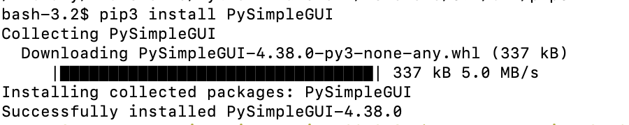
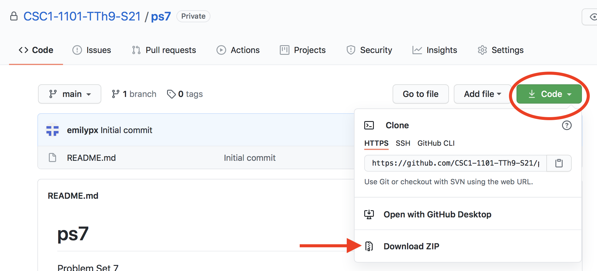
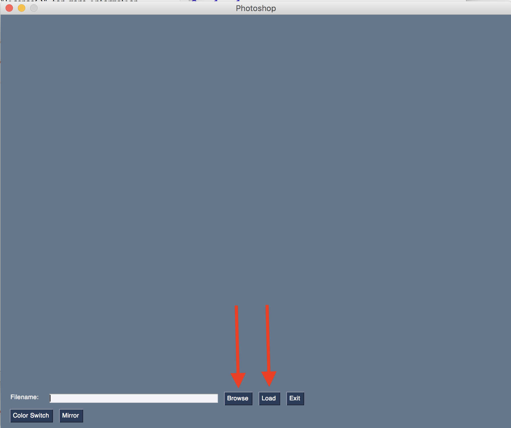
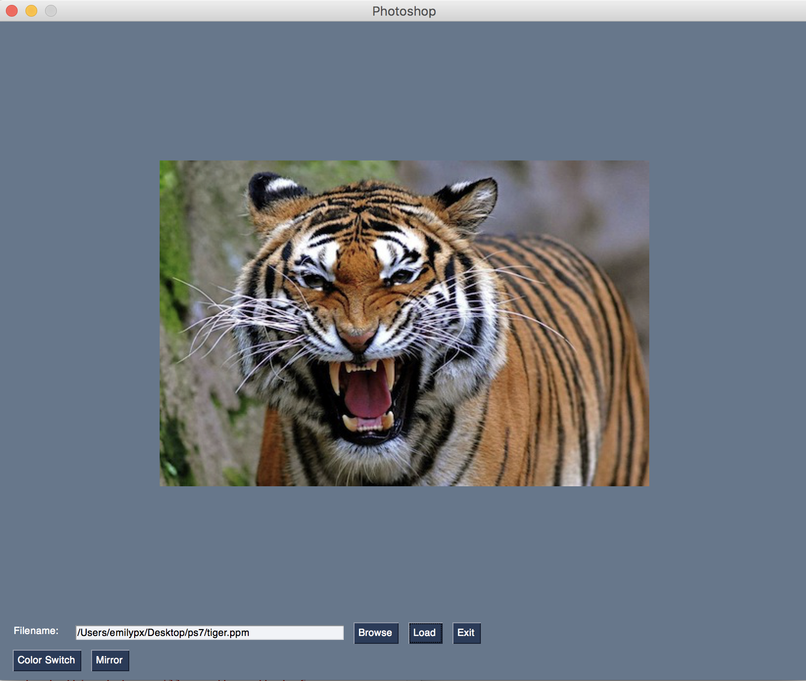
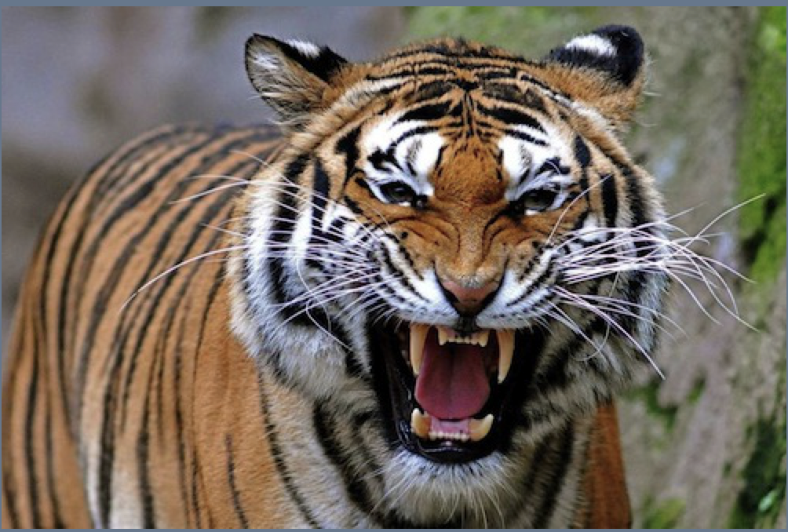
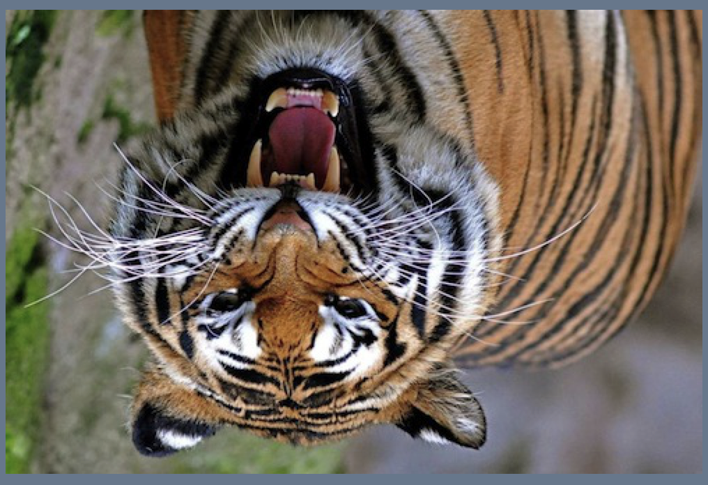

# Problem Set 7

### Due Tuesday, March 30, 2021, at 11:59pm EST

For this problem set, you will download this directory, modify the `ps7.py` program, then zip the folder back up and submit it to Canvas. Note that if you do not submit as specified, there will be a  deduction in your grade for this assignment.

As in Problem Set 6, I have given you starter code, and you will just have to write a few functions, as described below.

**Comments:** Two points will be deducted if you provide no or minimal comments, and 1 point will be deducted if you have sufficient comments but they do not conform to the requirements previously outlined.

**Honor pledge**: And, as always, in every program, the first four lines (comments) should be your honor pledge.

---
## Step 1: Install the libraries
You are going to do something you have not done before for this class: install new Python libraries! I will ask you to try this *in class on Thursday* in case you run into problems. I will be available to assist you during office hours. It is crucial that you do this before you start the rest of the program. Here's how it should work.

### Mac

1. On a Mac, use Spotlight Search (i.e., the magnifying glass that's usually in the upper right corner) and type `Terminal`. Then launch the Terminal app that it finds for you.
2. A boring plain text window will open. At the prompt, type:

```
pip3 install PySimpleGUI
```

3. If all goes well, you will see output like this. It's okay if you also see a `WARNING` about needing to update `pip`! As long as you don't see `ERROR`, it worked.



4. Launch IDLE. At the prompt in IDLE type:

```
import PySimpleGUI
```

5. If you get no ouput at all, you are good to go! If you get `ModuleNotFoundError: No module named PySimpleGUI` or something along those lines with the word "error", check to make sure that you didn't type something incorrectly. You can even just copy and paste what I have above to be sure. If you still get an error, try typing this in the Terminal:

```
/Library/Frameworks/Python.framework/Versions/3.9/bin/pip3 install PySimpleGUI
```

7. And if that still fails, email me, come to office hours, or post on Slack.

### Windows

1. On a Windows 10 machine, go to the `Start` menu and look for `Command` or search on your computer for `Command`, and launch it.

2. A boring plain text window will open. At the prompt, type:

```
pip install PySimpleGUI
```

3. This probably won't work, so you can also try one of these commands:

```
pip3 install PySimpleGUI
```

or

```
py -3 -m pip install PySimpleGUI
```

4. Those might not work either. If you get anything that says `ERROR` or `Command not found` or similar, the problem is probably that you did not follow instructions to tick the box about adding Python to your PATH when you installed it back in January. [Follow these instructions to either reinstall Python or to manually add Python your PATH](https://datatofish.com/add-python-to-windows-path/)

5. Quit  `Command` and reopen it, and try typing one of the three commands above.

6. If all goes well, you will see output that says something like `Successfully installed!`. It's okay if you also see `WARNING`s! As long as you don't see `ERROR` or `Command not found`, it probably worked.

7. Launch IDLE. At the prompt in IDLE type:

```
import PySimpleGUI
```

8. If you get no ouput at all, you are good to go! If you get `ModuleNotFoundError: No module named PySimpleGUI` or something along those lines with the word "error", check to make sure that you didn't type something incorrectly. You can even just copy and paste what I have above to be sure. If you still get an error, see me (if you're in class or can come to office hours) or post on Slack.


## Step 2: Get the files
**Download this folder to your computer and unzip it!** All the work you will do will take place in the downloaded version of this folder. When you're done, you will zip back up the folder you downloaded and submit it on Canvas. As a reminder, to download a folder from GitHub, click on the green `Code` button, then select `Download Zip`. And then of course, unzip it to see what's inside.




## Step 3: Run the starter program
1. In IDLE, open the file in the directory you just downloaded called `ps7.py`. (Don't open the other `.py` file!)
2. Run the program. 
3. You should see a very primitive-looking graphical user iterface (GUI), like this. (There is a lot of code in the `ps7.py` file that manages how this GUI works, together with the various modules that are imported. You won't be modifying that code.) Where indicated in the picture below, click `Browse`, and then select one of the `ppm` image files in this directory. 



4. Click the `Load` button next to the `Browse` button. If you select `tiger.ppm`, the GUI should now look like this:



5. Now click one of the two buttons in the lower left corner. Here I've selected `Mirror`. It creates a mirror image of the original photo! Click it again, and it will return to the original image.



6. Try the `Color Switch` button. You'll see that each time you click it, it changes the colors of the image. After three clicks, you get back to the original image.

**This GUI is kind of buggy.** If you aren't able to actually close the window or if it isn't responding, quit IDLE. If that doesn't help, do a "force quit" on Python (e.g., in Activity Monitor on a Mac, Task Manager on Windows).

---

## How does this work? [Click here to read a description](pixel.md). Then look at the code in `ps7.py` for the two functions I have written for you. You will also see that there are four functions that haven't been written yet. Your job is to write the first them! After you look at the code of `ps7.py`, come back to this page to find out your assignment.

---

## Step 4: Write the `greyscale()` function
To make an image greyscale, you simply take the average of all three RGB values at each pixel. Use the `colorswitch()` function I've provided as a guide. More details are provided in the comments in `ps7.py`. Don't forget to add your new button to the dictionary `effects`. Here's what the greyscale tiger should look like:


## Step 5: Write the `monochrome()` function
To make an image monochrome, take each pixel and sum all three components. If the sum exceeds some threshold, set all three components of the pixel to white (i.e., `[255, 255, 255]`). Otherwise, set all three components of the pixel to black (i.e. `[0,0,0]`). Use the `colorswitch()` function as a guide. Don't forget to add your new button to the dictionary `effects`. Here's what my monochrome tiger looks like. You should try several thresholds and pick the one that looks the best.


## Step 6: Write the `upsidedown()` function
This time use the mirror function as a guide, but instead of swapping pixels across an imaginary vertical line through the middle, swap them across an imaginary horizontal line through the middle. If this was your input image here:

```
[ [  [1, 1, 1], [2, 2, 2], [3, 3, 3]  ],
  [  [4, 4, 4], [5, 5, 5], [6, 6, 6]  ],
  [  [7, 7, 7], [8, 8, 8], [9, 9, 9]  ],
  [  [0, 0, 0], [0, 0, 0], [0, 0, 0]  ]  ]

```

The upsidedown image would be this:

```
[  [  [0, 0, 0], [0, 0, 0], [0, 0, 0]  ],
   [  [7, 7, 7], [8, 8, 8], [9, 9, 9]  ],
   [  [4, 4, 4], [5, 5, 5], [6, 6, 6]  ],
   [  [1, 1, 1], [2, 2, 2], [3, 3, 3]  ]  ]
```



Don't forget to add your new button to the dictionary `effects`.


## Step 7 (Optional!): Write a `pixelate()` function.
This is an optional exercise for people who want to have more "fun". To pixellate an image, divide the image into small square, e.g., 5 pixels by 5 pixels. Within each 5x5 square, set every R component to the average of all the R components in that square; set every G component to the average of all the G components in the square; set every B component to the average of all the B components in thst square.

---
## Trying other images

You've probably noticed that the images are in a weird format: `.ppm`. There are all kinds of online converters that will turn your jpegs into PPM format. You can give those a try if you'd like to apply these filters to your own photos. In addition, on Mac, you can use a [hidden export option in Preview](https://www.techjunkie.com/os-x-preview-export-image-formats/) to convert from jpeg to PPM.

---

## What to turn in
For this problem set, you downloaded this directory from GitHub, and you modified the `ps7.py` program I provided. Now just zip the folder back up and submit it to Canvas.

**Don't forget your comments!**

### This problem set is due Tuesday, March 30, 2021, at 11:59pm EST
